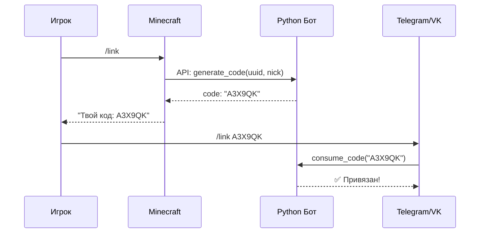

# 🎮 MCLink — Привязка Minecraft к VK и Telegram

<div align="center">


Система для привязки аккаунтов игроков Minecraft к VK сообществу и Telegram боту через коды подтверждения.

[Быстрый старт](#-быстрый-старт) • [Установка](#-установка) • [Документация](#-документация) • [FAQ](#-faq)

</div>

---

## ✨ Возможности

- 🔗 **Привязка аккаунтов** — игроки связывают Minecraft с Telegram или VK
- 🔐 **Безопасность** — коды живут 10 минут и одноразовые
- 🌐 **REST API** — плагин общается с ботом через HTTP
- 📊 **SQLite база** — хранение привязок локально
- 🤖 **Два бота** — Telegram + VK в одном приложении
- ☁️ **Cloud-ready** — готов к деплою на любой хостинг

---

## 🚀 Быстрый старт

### Для разработчиков

```bash
git clone https://github.com/ВАШ_USERNAME/mclink-bot.git
cd mclink-bot/bot
cp .env.example .env
# Заполни .env своими токенами
pip install -r requirements.txt
python main.py
```

### Для геймеров

1. Зайди на сервер Minecraft
2. Введи команду `/link`
3. Получи код (например: `A3X9QK`)
4. Отправь код боту в Telegram (`/link A3X9QK`) или VK (`link A3X9QK`)
5. Готово! ✅

---

## 📦 Установка

### Способ 1: Локально (для тестирования)

**Требования:** Python 3.10+

```bash
cd bot
pip install -r requirements.txt
cp .env.example .env  # заполни токены
python main.py
```

### Способ 2: Google Cloud Run (рекомендуется)

✅ Бесплатно до 2М запросов/месяц  
✅ Работает 24/7  
✅ Автоматический публичный URL

**[Подробная инструкция →](GOOGLE_CLOUD_DEPLOY.md)**

```bash
gcloud run deploy mclink-bot \
  --source . \
  --region europe-west1 \
  --allow-unauthenticated
```

### Способ 3: BotHost / Railway / Render

**[Инструкция для GitHub + хостингов →](GITHUB_BOTHOST.md)**

---

## 🎯 Процесс привязки



---

## 📁 Структура проекта

```
mc-link-bot/
├── bot/                        # Python бот
│   ├── main.py                 # Точка входа
│   ├── config.py               # Конфигурация
│   ├── database.py             # SQLite база
│   ├── api.py                  # REST API
│   ├── telegram_bot.py         # Telegram бот
│   ├── vk_bot.py               # VK бот
│   ├── requirements.txt        # Зависимости
│   └── .env.example            # Шаблон переменных
│
├── minecraft-plugin/           # Bukkit/Paper плагин
│   ├── pom.xml
│   └── src/main/
│       ├── java/               # Java код
│       └── resources/          # Конфиги
│
├── Dockerfile                  # Для Docker
├── docker-compose.yml          # Для локального запуска
├── railway.toml                # Для Railway.app
└── Procfile                    # Для Heroku-like хостингов
```

---

## 💬 Команды

### В Minecraft
- `/link` — получить код привязки
- `/linkstatus` — проверить привязку
- `/linkunlink` — инструкция по отвязке

### В Telegram
- `/start` — помощь
- `/link КОД` — привязать аккаунт
- `/unlink` — отвязать
- `/status` — показать привязку

### В VK (в личку сообществу)
- `help` — помощь
- `link КОД` — привязать
- `unlink` — отвязать
- `status` — показать привязку

---

## 🔌 REST API

API работает на порту 8080 (настраивается).

### Эндпоинты

**POST `/api/generate_code`**
```json
// Request
{ "uuid": "550e8400-...", "nick": "Steve" }

// Response
{ "code": "A3X9QK", "expires_minutes": 10 }
```

**GET `/api/check_link?uuid=...`**
```json
{
  "linked": true,
  "platform": "telegram",
  "user_id": "123456",
  "linked_at": "2024-01-01T12:00:00"
}
```

Все запросы требуют заголовок `X-API-Secret`.

---

## 🛡️ Безопасность

- ✅ API защищен секретным ключом
- ✅ Коды одноразовые и живут 10 минут
- ✅ UUID игрока может быть привязан только к одному аккаунту
- ✅ .env файл в .gitignore (токены не попадут в репозиторий)

---

## 🗺️ Дорожная карта

- [x] Telegram бот
- [x] VK бот
- [x] Minecraft плагин (Bukkit/Paper)
- [x] REST API
- [x] SQLite база
- [x] Docker поддержка
- [x] Google Cloud Run деплой
- [ ] PostgreSQL поддержка
- [ ] Discord бот
- [ ] Web-панель администратора
- [ ] Статистика привязок

---

## 📖 Документация

- [**QUICK_START.md**](QUICK_START.md) — быстрый старт для новичков
- [**GOOGLE_CLOUD_DEPLOY.md**](GOOGLE_CLOUD_DEPLOY.md) — деплой на Google Cloud
- [**GITHUB_BOTHOST.md**](GITHUB_BOTHOST.md) — GitHub + BotHost / Railway
- [**DOCKER_DEPLOY.md**](DOCKER_DEPLOY.md) — запуск через Docker

---

## ❓ FAQ

<details>
<summary><b>Можно ли использовать без VK?</b></summary>

Да! Просто оставь `VK_TOKEN` пустым в `.env`. Бот запустится только с Telegram.
</details>

<details>
<summary><b>Нужно ли открывать порты?</b></summary>

Зависит от способа запуска:
- **Google Cloud** — нет, всё автоматически
- **Локально + внешний сервер** — да, нужен проброс порта 8080 или ngrok
- **BotHost / Railway** — нет, хостинг предоставит URL
</details>

<details>
<summary><b>Сбрасывается ли база при перезапуске?</b></summary>

Зависит от хостинга:
- **Локально / Docker** — нет, база сохраняется
- **BotHost бесплатный** — может сбрасываться
- **Google Cloud Run** — сбрасывается при обновлении (используй Cloud SQL для продакшена)
</details>

<details>
<summary><b>Какой хостинг выбрать?</b></summary>

Рекомендации:
1. **Google Cloud Run** — бесплатно, надежно, публичный URL
2. **Railway.app** — простой, $5/месяц бесплатно
3. **Локально с ngrok** — для тестирования
</details>

---

## 🤝 Участие в разработке

Приветствуются Pull Request'ы! 

1. Форкни репозиторий
2. Создай ветку (`git checkout -b feature/amazing`)
3. Закоммить изменения (`git commit -m 'Add feature'`)
4. Запуш (`git push origin feature/amazing`)
5. Открой Pull Request

---

## 📜 Лицензия

MIT License — можешь свободно использовать, модифицировать и распространять.

---

## 💰 Поддержать проект

Если проект помог — поставь ⭐ звездочку на GitHub!

---

<div align="center">

**Сделано с ❤️ для Minecraft сообщества**

[⬆ Наверх](#-mclink--привязка-minecraft-к-vk-и-telegram)

</div>
